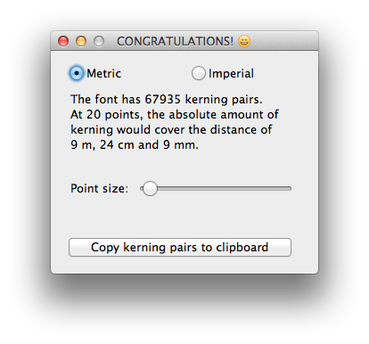

# kernDump 
---
Various scripts for analyzing, reading and writing kerning information.   
As Presented at [ATypI Amsterdam 2013](http://www.atypi.org/past-conferences/atypi-amsterdam-2013/amsterdam-programme/activity?a=265). 

## getKerningPairsFromOTF.py
Extract a list of all (flat) GPOS kerning pairs within a font, and report the absolute number of pairs.  

__Dependency__: [fontTools](http://sourceforge.net/projects/fonttools/)  
__Environment__: command line

```
python getKerningPairsFromOTF.py font.otf
python getKerningPairsFromOTF.py font.ttf
```

## dumpKernFeatureFromOTF.py
Dump a viable kern feature interpreted from the kerning data found within a font.

__Dependency__: `getKerningPairsFromOTF.py` (above)  
__Environment__: command line

```
python dumpKernFeatureFromOTF.py font.otf
python dumpKernFeatureFromOTF.py font.ttf
```

## getKerningPairsFromUFO.py
Extract a list of all (flat) kerning pairs in a UFO file, and report the absolute number of pairs.  

__Dependency:__ [defcon](https://github.com/typesupply/defcon) or Robofont  
__Environment:__ command line or Robofont

```
python getKerningPairsFromUFO.py font.ufo
```

## getKerningPairsFromFeatureFile.py
Extract a list of all kerning pairs that would be created from a feature file.  
This script is still in development, ‘compact’ notation within a single line is not yet fully supported.  
Compact notation example: `pos [ a adieresis aacute ] [ v w ] -1000;`

__Dependency:__ None  
__Environment:__ command line  

```
python getKerningPairsFromFeatureFile.py kern.fea
```

## kernInfoWindow.py
(Silly) visualization of absolute kerning distance.  
Example of making use of the above `getKerningPairsFromUFO.py` from within Robofont.  

__Dependency:__ `getKerningPairsFromUFO.py` (above)  
__Environment:__ Robofont

